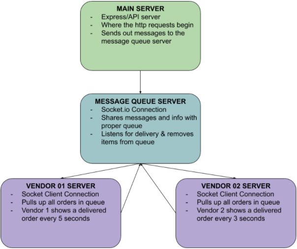

# LAB - Class 19

## Project Name: Message Queues

## Author: Sian Culligan

## Links and Resources
- [Sonia's Lecture Video](https://www.youtube.com/watch?v=1o2UrhI4MhE)
- [Socket.io Docs](https://socket.io/)

## Submission PR
- [Pull Request]()
- No .env

## How to initialize/run your application 
- Clone this repo
- Open 4 terminal windows, ensure each is on the root level
- Run ``nodemon queue-server.js``
- Run ``nodemon api.js``
- Run ``nodemon vendor-01.js``
- Run ``nodemon vendor-02.js``

## UML
